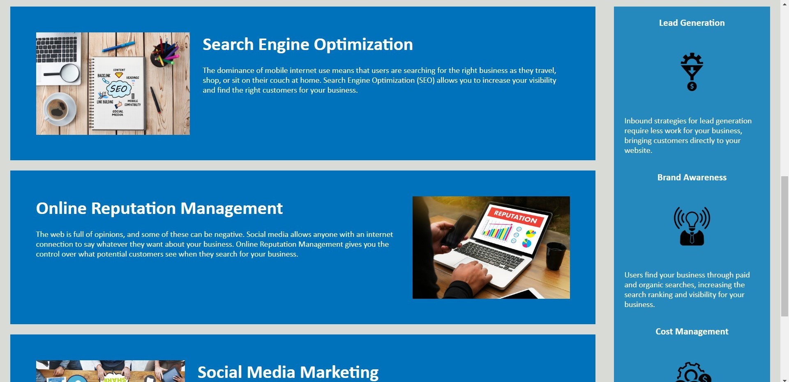

# Horiseon Social Solution Services Website

## About

This is an edited version of the Horiseon Services website. The HTML document and the CSS stylesheet both have been reflected to include semantic HTML elements instead of general div containers. This helps screen readers display content properly.

Along the way, an error with the navigation links was also fixed so now all three links go to their respective sections on the page when clicked on.

## Example

The following image shows the header and hero section of the page:

The following image shows the different sections of the website aligned with each other, side by side.

## Link

The link to the page is at https://cindyung56.github.io/horiseon-remake/

The link to the repository is at https://github.com/cindyung56/horiseon-remake
